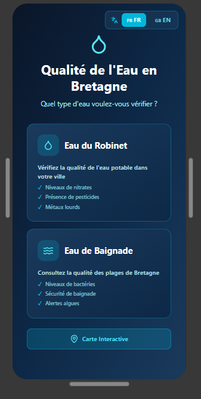

  # Water Quality Visualization App – Bretagne (Prototype)

This project is a prototype design of an application that visualizes water quality in the Brittany (Bretagne) region, France.

It is designed to help users easily understand and assess the quality of drinking water and bathing water, based on available indicators and classification results (good / poor quality).

The focus of this project is on UI/UX design and data visualization concepts, providing an intuitive way to explore water quality information. It is not a deployed system, but a design prototype for a potential environmental monitoring application.

Project also available at https://www.figma.com/design/Yervo5BJvOf3ZSxzgebRt8/Sans-titre.

⚙️ Concept Features
- Visualization of water quality status (good / bad)
- Simple classification of drinking and bathing water quality
- Data-driven UI concept for environmental health awareness
- User-friendly design for quick interpretation of water safety

  

  Main page of the Water Quality Visualization App prototype for Bretagne region.

## Running the code

Run `npm i` to install the dependencies.

Run `npm run dev` to start the development server.
  
